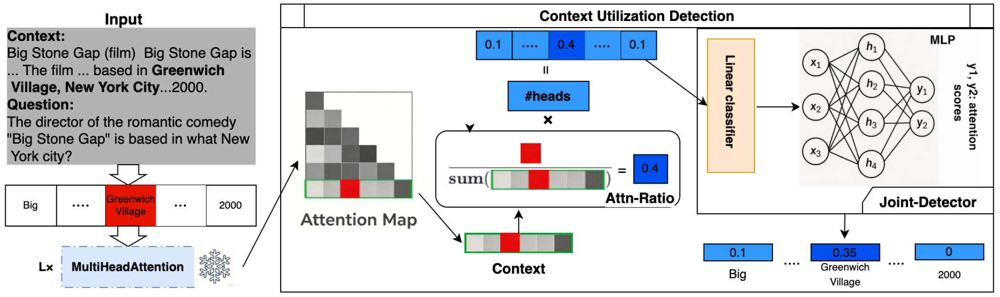
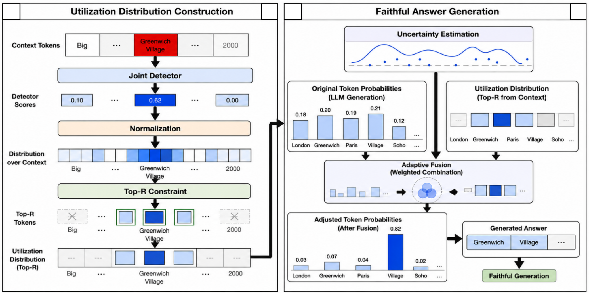
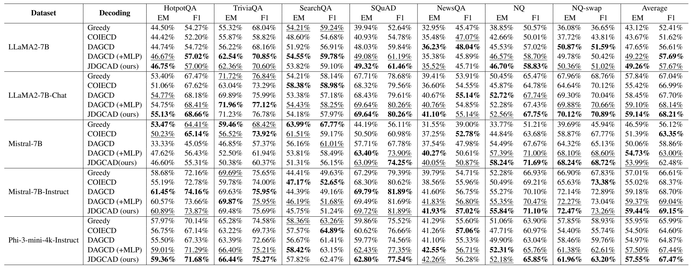

<p align="center">
<h1 align="center">Joint Detector-Guided Contextual Attention Decoding for Faithful Language Generation


## 🔍Overview


**JDGCAD** (Joint Detector-Guided Contextual Attention Decoding) is a training-free and lightweight decoding framework designed to mitigate **context faithfulness hallucinations** in Large Language Models (LLMs) — **without finetuning the LLM**.

- **Single-pass decoding with zero editing overhead:** Real-time alignment of output distributions within a single decoding process, eliminating the need for multiple passes or post-hoc editing pipelines.
- **Non-linear joint attention detection:** Leverages a hybrid LR+MLP architecture to filter out redundant feature heads and capture intricate, non-linear feature interactions from internal attention maps.
- **Dynamic uncertainty-driven guidance:** Couples token-level uncertainty signals (MSP and Normalized Entropy) with the joint detector's scores to precisely reinforce context-relevant tokens during highly uncertain generation steps.
- **Robustness in long-context and knowledge-conflict scenarios:** Demonstrates exceptional cross-domain and data-size independence, outperforming prior linear approaches in noisy or conflict-heavy environments.
- **Plug-and-play generalizability:** Consistently enhances exact-match accuracy across diverse open-domain QA tasks, fully compatible with both pre-trained and instruction-tuned models (e.g., LLaMA and Mistral families).






---


## 📊Evaluation Results



---

## 🎯Quick Start

### :one:Clone this repo

```shell
git clone https://github.com/limenpro/JDGCAD.git
cd JDGCAD/src
```


### :two:Install dependencies

```shell
# step 1: create a virtual environment
conda create -n jdgcad python=3.9

# step 2: activate the virtual environment
conda activate jdgcad

# step 3: install dependencies from requirements.txt
python -m pip install -r requirements.txt
```


### :three:Download Data

We download QA datasets from [MrQA](https://huggingface.co/datasets/mrqa-workshop/mrqa) and [NQ-Swap](https://huggingface.co/datasets/pminervini/NQ-Swap), and we use MrQA train set for training Context Utilization Detector and validation set for evaluation. We also download the summary dataset from [CNN_DM](https://huggingface.co/datasets/abisee/cnn_dailymail).

```shell
python prepare_data.py

# data will be saved in ../datasets/
```


### :four:Train Context Utilization Detector

Training the Context Utilization Detector for the specific LLM.

```shell
python train_detector_mlp.py --model {huggingface_id} --hf_token {hf_token}
```

- `huggingface_id`: the Hugging Face ID of the LLM.
- `hf_token`: the hugging face user token.

**Example**：

```shell
# set cuda devices
export CUDA_VISIBLE_DEVICES=0  # single device
export CUDA_VISIBLE_DEVICES=0,1  # multiple devices (Note! This only splits the model across multiple devices. It does not split the data.)

python train_detector_mlp.py --model meta-llama/Llama-2-7b-hf
python train_detector_mlp.py --model meta-llama/Llama-2-7b-hf

# LLM model will be saved in ../models/llama-2-7b-hf (the model filename is the lowercase basename of the huggingface_id).
# Context Utilization Detector will be saved in ../dector/
```


### :five:Apply DAGCD during Inference-Time

Apply Dynamic Attention-Guided Context Decoding during inference-time.

```shell
python JDGCAD.py --model {model_name} --data {dataset_name} --topk {topk features} --top_rank {top_rank}
```

- `model_name`: the lowercase basename of the LLM's Hugging Face ID.
- `dataset_name`: the QA dataset names.
  - options: `HotpotQA`, `TriviaQA-web`, `SearchQA`, `SQuAD`, `NewsQA`, `NaturalQuestionsShort`, `NQ-swap`
- `topk`: the topk feature coefficient detector, set `10` for default.
- `top_rank`: the top-rank filtering, set `10` for default.

**Example:** 

```shell
# set cuda devices
export CUDA_VISIBLE_DEVICES=0  # single device
export CUDA_VISIBLE_DEVICES=0,1  # multiple devices (Note! This only splits the model across multiple devices. It does not split the data.)

python JDGCAD.py --model llama-2-7b-hf --data HotpotQA --rank 10
python JDGCAD.py --model llama-2-7b-hf --data HotpotQA --rank 10

# the results will be saved in ../results/llama-2-7b-hf/
```

---


